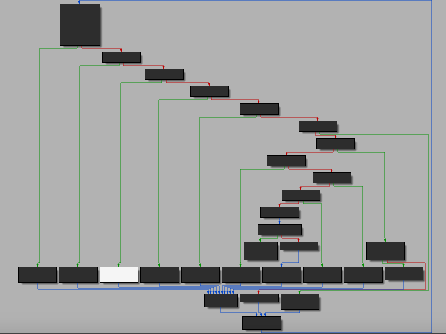

**Intro**

I recently got interested in code virtualization, and wanted to learn how to deobfuscate this type of technique. In order to learn more, I will attempt to solve a simple vm (virtual machine) crack me. We will be looking at miniVMCrackme1 by Craig Smith, which was published on June 9, 2008. It has a difficulty of 2, and was created to demonstrate how VMs work.  

Before we get started, I will quickly go over code virtualization and virtual machine usage. Code virtualizaiton is an obfuscation technique. It uses a virtual machine (VM), a mechanism used to execute a different instruction set than the one used by machine that runs the program.  

**The Challenge**

`Find a valid password, write a solution detailing the techniques used to analyze the VM. Patching is not allowed` 

The executable is desktop program, with a GUI. When the executable is run, a window appears with an input box. Upon entering a random string, “abcdefg”, a dialog box appears telling us that our password is incorrect.

**Static Analysis** 

The executable is a Windows application, since Win32 functions such as ShowWindow are listed in its imports.  From the imports, I looked at where GetWindowTextLengthA is called.  It was called in DialogFunc, which contains the operations relating to the GUI. 

—

The GetWindowTextLengthA function was called to check if what was entered in the input box is not empty ( jumps if below or equal to one). If it was, then it jumps to loc_40190E, jumping to the end of our DialogFunc. Otherwise, it continues to the following block of code:

```python
push    offset unk_403034 ; lParam
push    14h             ; wParam
push    0Dh             ; Msg
push    dword_403030    ; hWnd
call    SendMessageA
mov     eax, offset unk_403049
mov     dword ptr [eax], offset unk_403034
push    offset dword_4016BC
push    offset unk_403049
call    CallVm_401000
mov     eax, offset unk_403049
mov     eax, [eax]
mov     ebx, offset ShowResult
add     ebx, eax
call    ebx
```

(*sidenote: some functions have already been renamed)*

It seems that this is where the virtual machine operation is located. The bytecode of the virtual machine (dword_4016BC), and unk_403049- that stores our input string (password) are pushed to the stack. After that, CallVm_401000 is called. 

```python
CallVm_401000 proc near
pop     ebx
pop     eax
mov     dword_40301C, eax
pop     eax
mov     dword_403010, eax
mov     dword_403014, eax
pusha
mov     dword_403020, 0
mov     dword_403018, 0
call    sub_40102F
popa
push    ebx
retn
CallVm_401000 endp ; 
```

The pop instruction retrieves what was pushed in the stack. Earlier, `dword_4016BC` containing our bytecode, and `unk_403049` containing our input string was pushed to the stack. These values are stored in the virtual registers of the virtual machine.

We can assume that the virtual registers are: `dword_40301C, dword_403010, dword_403014, dword_403020, and dword_403018` . After looking at each of their cross references, we can see that these values are used like registers. 

Let us take a look at its control flow graph of `sub_40102F` , which is called. 



*Figure 1: Control Flow of VM*

We see the graph has a central basic block, as apparent on the top-most left corner. This is the dispatcher which directs the control flow to individual basic blocks called handlers. 

```python
sub_40102F      proc near               ; CODE XREF: CallVm_401000+27↑p
.text:0040102F                                         ; sub_40102F:loc_40107C↓j
.text:0040102F                 mov     ebx, dword_403010
.text:00401035                 xor     eax, eax
.text:00401037                 xor     ecx, ecx
.text:00401039                 xor     edx, edx
.text:0040103B                 mov     al, [ebx]
.text:0040103D                 mov     dl, al
.text:0040103F                 and     dl, 0Fh
.text:00401042                 and     al, 0F0h
.text:00401044                 cmp     al, 0C0h
.text:00401046                 jz      short loc_40107E
.text:00401048                 cmp     al, 0B0h
.text:0040104A                 jz      short loc_401085
.text:0040104C                 cmp     al, 0D0h
.text:0040104E                 jz      short loc_40108C
.text:00401050                 cmp     al, 0E0h
.text:00401052                 jz      short loc_401093
.text:00401054                 cmp     al, 0
.text:00401056                 jz      short loc_40109A
.text:00401058                 cmp     al, 10h
.text:0040105A                 jz      short loc_4010A1
.text:0040105C                 cmp     al, 20h ; ' '
.text:0040105E                 jz      short loc_4010A8
.text:00401060                 cmp     al, 30h ; '0'
.text:00401062                 jz      short loc_4010B6
.text:00401064                 cmp     al, 50h ; 'P'
.text:00401066                 jz      short loc_4010BD
.text:00401068                 cmp     al, 60h ; '`'
.text:0040106A                 jz      short loc_4010C4
.text:0040106C                 cmp     al, 40h ; '@'
.text:0040106E                 jnz     short sub_4010D3
.text:00401070                 cmp     dl, 3
.text:00401073                 jz      short locret_4010D2
.text:00401075                 jmp     short loc_4010CB
```

Looking at this assembly code, we can know that the logic continues based on the bytecode, or opcode. Before control flow is redirected to a different handler, the bytecode must meet a certain condition in order to execute. 

For example, if `al` is equal to `0C0h`, it will short jump to `loc_40107E`. 

```python
.text:0040107E loc_40107E:                             ; CODE XREF: sub_40102F+17↑j
.text:0040107E                 call    sub_4010F8
.text:00401083                 jmp     short loc_401077
```

It calls the handler we will have to reverse `sub_4010F8`.  The handler will contain the code that will execute for the specific bytecode of `0C0h`

**Dynamic Analysis** 

Usually, a virtual machine works by iterating the bytecode array and decoding the corresponding instruction.   Analyzing the program with a debugger will help us confirm our assumptions. 

```python
.text:004016BC dword_4016BC    dd 0CBB039h, 0CA000000h, 0
.text:004016BC                                         ; DATA XREF: DialogFunc+B4↓o
.text:004016C8                 dd 0FF4042h, 0D80000h, 20000000h, 26h, 0E93B3063h, 0C10B0h
.text:004016C8                 dd 9AC80000h, 3000002h, 0D8h, 3C2000h, 10320000h, 42h
.text:004016C8                 dd 18CAh, 4E433200h, 61686F65h, 73697370h
.text:00401708
```

Earlier, we know that `dword_4016BC` contains our bytecode. The logic continues based on each opcode.  

**Disasembler**

We can try to create a disassembler to show how the virtual machine works.

```python
data = "39b0cb00000000ca000000004240ff000000d800000000202600000063303be9b0100c000000c89a02000003d800000000203c000000321042000000ca180000003243"

arr, i= [],0
for x in range(0, len(data), 2):
    arr.append(int(data[x:x+2], 16))

while i < len(arr):
    instr = arr[i]
    if instr == 0x39:
        print('MOV R2, [R8 + R7]')
        print("MOV R7, 4")
        i+= 1
    if instr == 0xb0:
        print("MOV R1, R2")
        i+= 1
    # +5 
    if instr == 0xcb:
        print("MOV R4, " + hex(arr[i+1]))
        i+= 5

    if instr == 0xca:
        print("MOV R3, " + hex(arr[i+1]))
        i+= 5

    if instr == 0x42:
        print("MOV R1, [R1]")
        i+= 1

    if instr == 0x40:
        print("AND R1, " + hex(arr[i+1]))
        i+= 5
    if instr == 0xd8:
        print("CMP R1, " + hex(arr[i+1]))    
        i+= 5
    if instr == 0x20:
        print("JNZ R6 + " + hex(arr[i+1]))
        i+=5 

    if instr == 0x63:
        print("ADD R1, R4")
        i += 1

    if instr == 0x30:
        print("SUB R7, 4")
        print("MOV [R8+R7], R1")
        i += 1

    if instr == 0x3b:
        print("MOV R4, [R8 + R7]")
        print("ADD 7, 4")
        i += 1

    if instr == 0xe9:
        print("INC R2")
        i += 1 

    if instr == 0x10:
        print("JMP R6 + " + hex(arr[i+1]))
        i += 5 

    if instr == 0xc8:
        print("MOV R1, " + hex(arr[i+1]))
        i+= 5

    if instr == 0x03:
        print("XOR R1, R4")
        i += 1 

    if instr == 0x32:
        print("SUB R7, 4")
        i += 1

    if instr == 0x43:
        print("ret")
        i += 1
```

